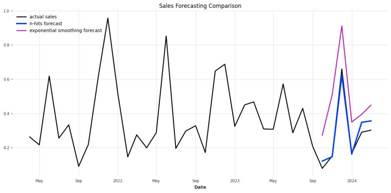
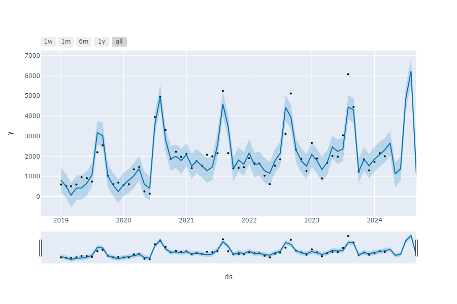

# Forecasting Sales with Time Series Data
1. Developed an automated testing environment using the Darts library and fine-tuned various models (N-HiTS, N-BEATS, TiDE), enhancing forecast accuracy by up to **84.05%** and improving MAE by **16.88%**. See ``darts_results.py``

2. Customized Meta’s Prophet model to accurately predict holiday effects, improving MAPE by **42.3%**. See ``notebooks/prophet_holidays.ipynb``

## Web routes

All routes are available on ``/docs`` or ``/redoc`` paths with Swagger or ReDoc.

## setup

install pyenv:
https://brain2life.hashnode.dev/how-to-install-pyenv-python-version-manager-on-ubuntu-2004

```
pyenv install 3.10.7
pyenv global 3.10.7

pip install poetry

cd <project>
poetry install
```
### test
```
poetry run pytest
```

## Load demo data
```
poetry run pytest tests/models/test_save_demo_data.py
```

## Run as docker
```
docker-compose build

docker-compose up -d db
docker-compose up -d backend
```

## Run as python
```
poetry run uvicorn app.main:app --reload
```

## Visuals
Fine-tuned various models (N-HiTS, N-BEATS, TiDE), enhancing forecast accuracy by up to **84.05%** and improving MAE by **16.88%**.



---

Customized Meta’s Prophet model to accurately predict holiday effects, improving MAPE by **42.3%**.

